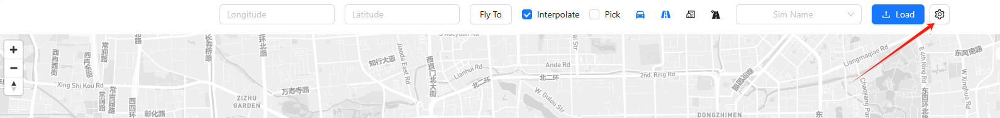
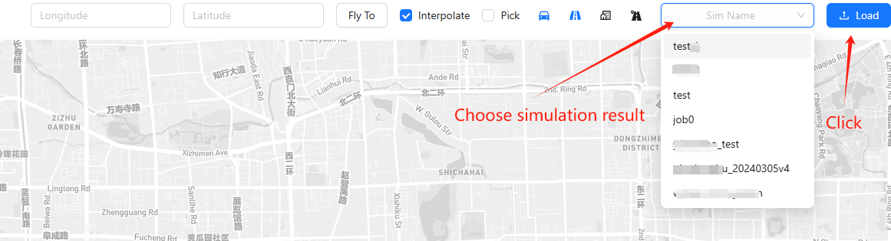
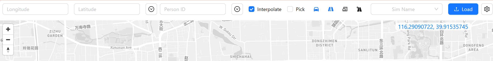
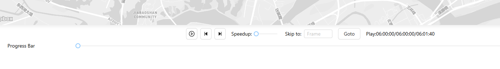
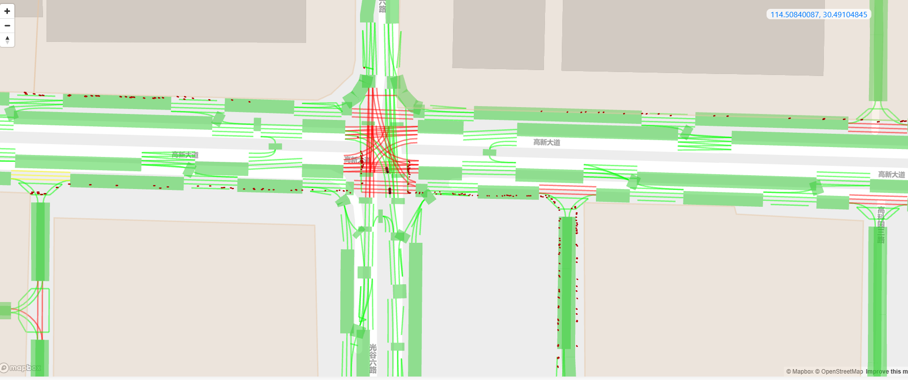

# moss-webui-frontend

A Web UI to visualize the PostgreSQL output by MOSS.

Github Page: https://tsinghua-fib-lab.github.io/moss-webui-frontend/

## Guide

You can set the [backend server](https://github.com/tsinghua-fib-lab/moss-webui-backend) address in the Web UI.

**Please pay attention to the CORS policy if you fail to connect to the backend server.**

When you run the frontend or enter our GitHub page, the first thing you should do is to set the backend server address.
The setting is in the top right corner of the page.

Then you can set the backend server address and click the "Apply" button to save the setting.
The setting will be saved in the local storage of your browser.

After setting the backend server address, you can open the dropdown menu to select the simulation you want to visualize by name.

Then you can click the "Load" button to load the simulation.

If you load the simulation successfully, you can see that the map are moving to the center of the simulation.
Now you can start to visualize the simulation.

You can choose the enabled functions and layers in the top panel.
- Longitude/Latitude: enter the longitude and latitude to move the map to the specific location.
- Person ID: enter the person ID to move the camera to the pedestrian/vehicle.
- `Interpolate`: interpolate the data between two steps to make the animation smoother, but the middle frames are not real data.
- `Pick`: you can hover the mouse on the vehicles, pedestrians, and buildings to see the details.
- Vehicle Icon: open/close the layer that shows the vehicles, pedestrians, and traffic lights.
- Road Icon: open/close the layer that shows the road status.
- Building Icon: open/close the layer that shows the AOIs.
- Road Icon 2: open/close the layer that shows all lanes.



You can also control the speed and the step of the simulation visualization in the bottom panel.
There are a progress bar, a play/pause button, a speed control, and a step control.


In the visualization, we show all elements as follows:
- Vehicles: 3D models. (**ATTENTION: the 3D models are not always match the vehicle attributes in the simulation, the models are 5m long and 2m wide**)
- Pedestrians: red points.
- Traffic Lights: green/yellow/red color lines.
- Road status: translucent color blocks
- AOIs: translucent color blocks out of the road net.



## Installation & Run

```bash
npm install
npm run dev # for development
npm run build # for production
```

## Github Pages Refresh

```bash
npm run deploy
```
